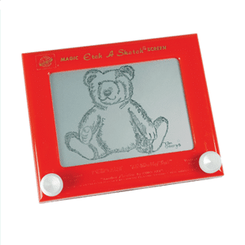

#  Etch-a-Sketch

Ceci est une version web de l'appareil de dessin Etch a Sketch.
Vous pouvez l'utiliser pour faire s'exprimer l'artiste qui repose en vous.

# Comment ça marche

- 
Vous dessinez sur le tableau en maintenant le clic droit de votre souris

# Construit à partir de :

J'ai réalisé ce projet avec ces technologies classiques du web :

- HTML : Pour la structure du projet
- CSS : Pour le style et la mise en forme
- JavaScript : pour la manipulation du DOM et rendre les choses dynamiques

A ouvrir sur pc pour une meilleure expérience

